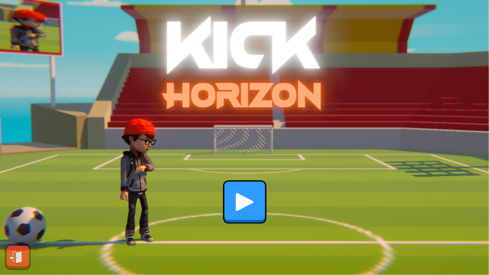
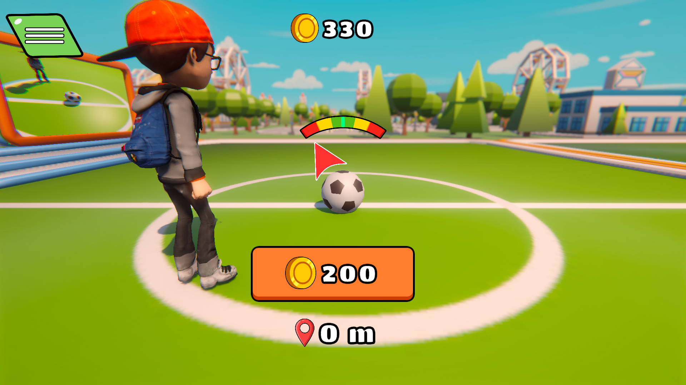

<div align="center">

# ⚽ KICK HORIZON



### *Kick the ball. Break the horizon.*

[](https://unity.com/)
[](#installation)
[](#theme-interpretation)
[](https://itch.io/jam/12th-iut-ict-fest-2026-gamejam)

---

**Kick Horizon** is a 3D arcade-style football kicking game where you time your kicks, aim for perfection, and send the ball soaring across stunning low-poly island landscapes. Earn coins based on distance, upgrade your kick force, and chase the horizon!

**🏆 Team Jupiter** &nbsp;|&nbsp; **IUT 12th ICT FEST 2026 - GameJam**

</div>

---

## 📸 Gameplay Preview

<div align="center">

</div>

---

## 🎮 About the Game

**Kick Horizon** is our creative take on the **"KICKOFF"** theme. Rather than building a traditional football match, we designed a game around the *raw thrill of a single, powerful kick* — the kickoff that launches the ball toward the horizon.

You play as a kicker standing on a vibrant island. Time the oscillating aim indicator, kick the ball, and watch it fly across gorgeous low-poly environments, bouncing off terrain and soaring past scenic landmarks. The farther the ball travels, the more coins you earn. Smash bottles scattered across the map for bonus rewards! Spend those coins to upgrade your kick power and send the ball even further!

### ✨ Key Features

| Feature | Description |
|---|---|
| 🎯 **Aim & Kick Mechanic** | An oscillating angle indicator swings left and right — press **Space** at the right moment for a perfectly aimed kick |
| 🏟️ **Distance-Based Scoring** | Earn coins proportional to how far the ball travels |
| ⬆️ **Upgrade System** | Spend coins to increase kick force through multiple upgrade tiers |
| 🔥 **Perfect Kick Effects** | Nail a perfect angle to trigger slow-motion, fire trails, camera shake, FOV zoom, and dramatic audio |
| 💬 **Live Commentary** | Dynamic feedback on kick accuracy — from "PERFECT!" to "OOPS!" |
| 🏝️ **Vibrant Low-Poly World** | Beautiful island landscapes with palm trees, city buildings, and scenic landmarks |
| 🍾 **Bottle Cracking Bonus** | Bottles are scattered across the map — if the ball smashes one, you earn a **+100 coin bonus**! |
| 🎵 **Full Audio Design** | Kick sounds, ball bouncing, coin rewards, dramatic hits, and UI feedback sounds |
| 💾 **Save System** | Your progress (money, upgrades) is saved automatically using JSON serialization |
| 🎥 **Cinematic Camera** | Cinemachine-powered camera with dynamic shake, FOV adjustments, and smooth follow |

---

## 🎯 Theme Interpretation

> **Theme: KICKOFF**

We interpreted "KICKOFF" as the essence of a football match's opening moment — the one powerful kick that sets everything in motion. In **Kick Horizon**, the entire game revolves around perfecting that *single kickoff*. Each kick is a launch into the unknown — a ball sent soaring toward the distant horizon. The game captures the excitement, anticipation, and satisfaction of that defining moment.

The progression system reinforces the theme: each kickoff takes the ball further as you upgrade, gradually pushing the boundary of what's reachable — always chasing the horizon.

---

## 🕹️ How to Play

### Controls

| Input | Action |
|---|---|
| `Space` | Kick the ball (time it with the oscillating aim indicator!) |
| `Mouse Click` | Click the on-screen **Reset** button (appears after the ball stops) to set up the next kick |

### Gameplay Loop

1. **Aim** — Watch the oscillating angle indicator swing left and right
2. **Kick** — Press `Space` when the indicator is centered for maximum accuracy
3. **Watch** — The ball soars through the air — smash bottles along the way for bonus coins!
4. **Earn** — Collect coins based on the distance the ball travels (+ bottle bonuses)
5. **Reset** — Click the on-screen **Reset** button to set up your next kick
6. **Upgrade** — Spend coins to boost your kick force
7. **Repeat** — Kick harder, fly further, chase the horizon!

> 💡 **Pro Tip:** A perfectly timed kick (angle < 5°) triggers a dramatic slow-motion effect with fire trails — and gives you maximum distance!

---

## 🛠️ Installation

### Prerequisites
- **Windows 10/11** (64-bit)

### Playing the Game
1. Download the latest release from the [Releases](https://arsayem53.itch.io/kick-horizon) page.
2. Extract the ZIP file
3. Run **`Kickoff.exe`**
4. Enjoy!

> ⚠️ No additional software is required. The game runs standalone on Windows PC.

### Building from Source
1. Install **Unity 6000.4.0f1** (Unity 6)
2. Clone this repository:
   ```bash
   git clone https://github.com/YOUR_USERNAME/Kickoff_Git.git
   ```
3. Open the project in Unity Hub
4. Open the `MainMenu` scene from `Assets/________________Scene/`
5. Press **Play** to test, or build via **File → Build Settings → Build**

---

## 🏗️ Project Architecture

```
Assets/
├── ________________Animation/     # Character & UI animations
│   ├── Ball/
│   ├── Character/
│   ├── Map/
│   └── UI/
├── ________________Art/           # Sprites & UI art assets
│   └── UI/
├── ________________Audio/         # Sound effects & music
├── ________________Fonts/         # Custom fonts
├── ________________Materials/     # Shaders & materials
├── ________________Prefab/        # Prefabs (Ball, Map, Effects, Landmarks)
│   ├── Ball/
│   ├── Effects/
│   └── Map/
├── ________________Render Texture/ # Render textures
├── ________________Scene/         # Unity scenes
│   ├── MainMenu.unity            # Main menu scene
│   └── Game.unity                # Core gameplay scene
├── ________________Scripts/       # All C# game scripts
│   ├── Ball/                     # Ball physics, launching, collision
│   ├── Camera/                   # Cinemachine camera effects
│   ├── Character/                # Kicker character & animations
│   ├── Manager/                  # Singletons (Currency, Save, Sound, etc.)
│   ├── Save System/              # Save data structure
│   ├── Scene/                    # Scene management
│   ├── UI/                       # UI Manager
│   └── Upgrade System/           # Upgrade data & tiers
└── ________________Third Party Assets/
    ├── Balls/                    # Ball Pack, Lightning Poly
    ├── Character/                # AJ character model
    ├── Effects/                  # VFX assets
    ├── Maps/                     # Palmov Island, SimplePoly City, Skybox
    ├── Materials/
    ├── Sound/
    └── UI/
```

### Core Systems

| System | Scripts | Description |
|---|---|---|
| **Ball Physics** | `ProjectileLauncher`, `ProjectileLaunchAngleOscilation`, `BallStopDetector`, `ProjectileDistance`, `ProjectileCollisionEvents` | Handles ball launching with configurable force/angle, distance tracking, stop detection, and bottle-smash collision bonuses |
| **Kick System** | `Kicker`, `KickerAnimationEvents`, `ProjectileCommentary` | Triggers kick animation, calculates accuracy commentary, coordinates visual feedback |
| **Effects** | `EffectsManager`, `CameraShakeController` | Perfect-hit slow motion, fire/common trails, camera shake, FOV zoom, particle effects |
| **Economy** | `CurrencyManager`, `UpgradeManager`, `KickForceUpgradeData` | Distance-based coin rewards, tiered kick force upgrades with price progression |
| **Persistence** | `SaveManager`, `SaveData` | JSON-based save/load for money and upgrade levels |
| **Audio** | `SoundManager` | Centralized sound playback for kicks, bounces, coins, UI, and dramatic effects |
| **UI** | `UIManager` | Manages oscillation indicator, distance display, currency, upgrade buttons, and menu panels |

---

## 🔧 Tech Stack

| Technology | Details |
|---|---|
| **Engine** | Unity 6 (6000.4.0f1) |
| **Render Pipeline** | Universal Render Pipeline (URP) 17.4.0 |
| **Language** | C# |
| **Input System** | Unity New Input System 1.19.0 |
| **Camera** | Cinemachine 3.1.7 |
| **UI** | Unity UI (uGUI) + TextMeshPro |
| **Post Processing** | Post Processing Stack v2 (3.5.1) |
| **Physics** | Unity 3D Physics (Rigidbody-based projectile) |
| **Animation** | Unity Animator with Mecanim |
| **Save System** | JSON serialization via `JsonUtility` |
| **Platform** | Windows PC (Keyboard & Mouse) |

---

## 👥 Team Jupiter

We are **Team Jupiter**, a passionate group of game developers competing in the **IUT 12th ICT FEST 2026 GameJam**.

| Role | Member |
|---|---|
| 🎮 Game Developer | [Irfan Rahaman Iram](https://github.com/VioletShadow777-oss) |
| 🎨 Art & Design | [Ashiqur Rahaman Sayem](https://github.com/arsayem53) |
| 🔊 Audio & SFX | [Shakil Ahamed Reyad](https://github.com/ShakilAhamedV2) |

---

## 📋 Game Jam Details

| Detail | Info |
|---|---|
| **Event** | [IUT 12th ICT FEST 2026 - GameJam](https://itch.io/jam/12th-iut-ict-fest-2026-gamejam) |
| **Theme** | KICKOFF |
| **Duration** | July 14 – July 20, 2026 |
| **Engine** | Unity 6 |
| **Platform** | Windows PC |
| **Hosted by** | [NazmusSadiq](https://nazmussadiq.itch.io/) & [IUT_ICT_Fest_2026](https://iut-ict-fest-2026.itch.io/) |

### Judging Criteria

| Criteria | Weight |
|---|---|
| 🎯 Theme | 25% |
| 🎮 Gameplay | 25% |
| 🏗️ Design | 25% |
| 🎨 Visual & Audio | 15% |
| 🎥 Video (Pitch) | 10% |

---

## 📄 License

This project was created for the **IUT 12th ICT FEST 2026 GameJam**. All original code and assets are © 2026 Team Jupiter. Third-party assets are used under their respective licenses.

---

<div align="center">

### ⚽ *Every great journey starts with a single kick.*

**Made with ❤️ by Team Jupiter**

[](https://unity.com/)
[](https://itch.io/jam/12th-iut-ict-fest-2026-gamejam)

</div>
